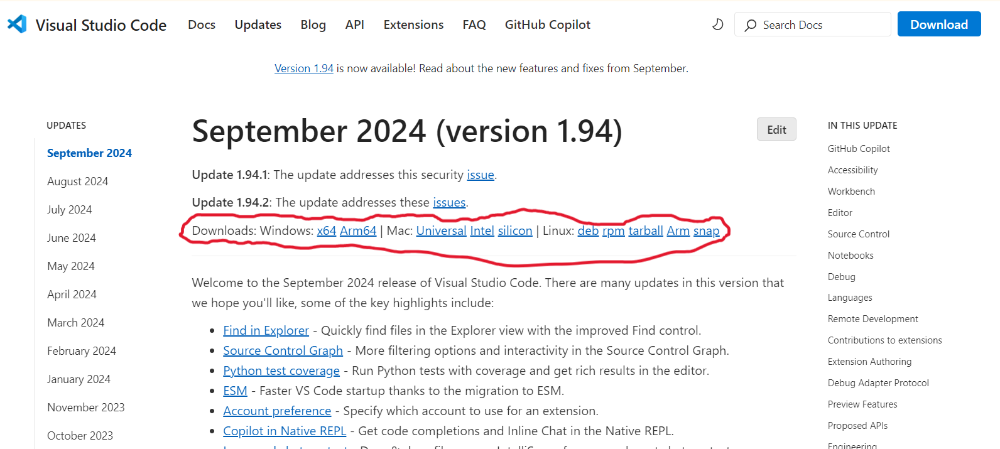
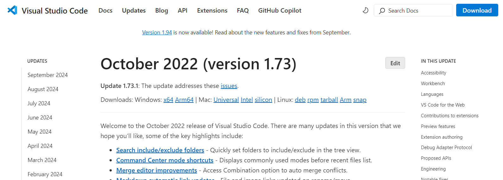
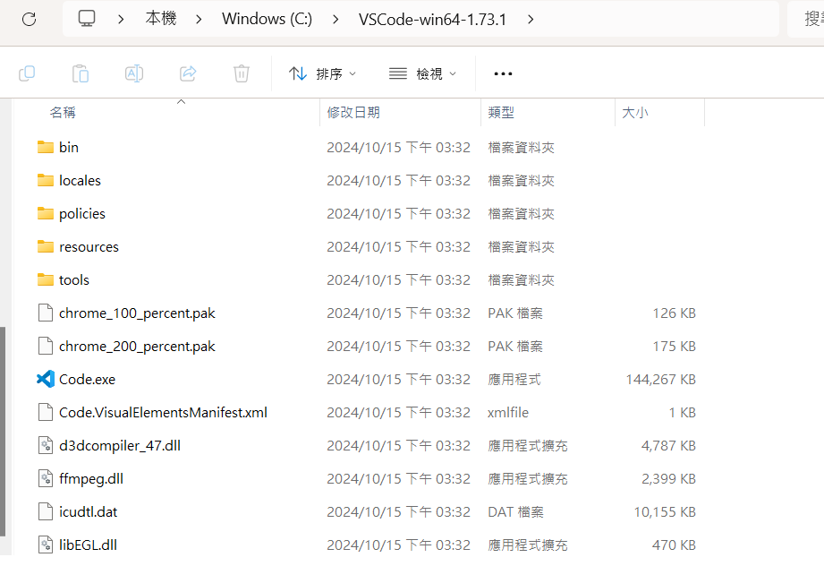
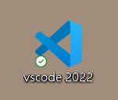
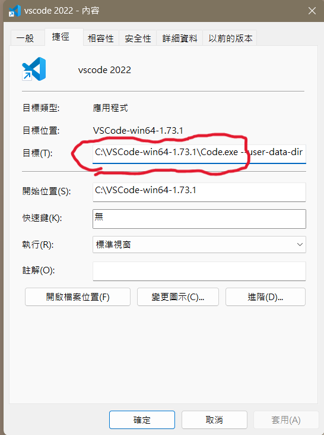
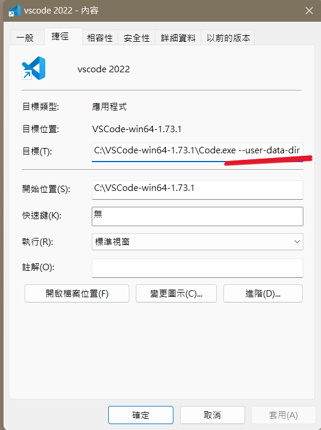

# VS-Code-Multi-Version
## 本 Repositories 將探討如何讓不同版本的 VS Code 在同一台電腦上共存

先說一下我的情況：先前已下載 VSCode 2024 (version 1.94) 版本，後來因為一些因素所以需要先前的版本，因而開始研究該該如何讓他們之間可以克服版本可能不相容，或者現在的版本被先前版本蓋掉的問題。
<hr>

首先，先假設你已經安裝 vscode 並可已成功執行程式 \

原先版本 \
 \
[vscode 2024 version (version 1.94)](https://code.visualstudio.com/updates/v1_94)

我需要的先前的版本 \
 \
[vscode 2022 version (version 1.73)](https://code.visualstudio.com/updates/v1_73)

但這裡只有提供執行檔(.exe)，我需要的要是壓縮檔(.zip)，所以需要去 github 找先前上傳的版本 \
 \
[vscode release version](https://github.com/portapps/vscode-portable/releases)

下載打紅色勾勾的那個壓縮檔 \
解壓縮之後，把它放在一個你開心的位置，我放在C槽底下 \


接著把 2022 版本的 "Code.exe" 建立捷徑到桌面，命名成你開心的名字，我叫 "vscode 2022" \


點開捷徑的內容，選擇捷徑，在捷徑的目標下有指向 Code.exe 的路徑 \


在後面加上此行命令行參數(--user-data-dir....前面有一個空白鍵喔)
```
 --user-data-dir "C:\VSCodeData\2022" --extensions-dir "C:\VSCodeExtensions\2022"
```
補充：此命令行參數來分離不同版本的用戶數據和擴展 \
結果如下 \


2024也可以加上命令行參數，不加也行(我有加哈哈，就有3個vscode環境可以編輯)

由捷徑點 2 下開啟 vscode，就會開始建置環境，VSCodeData跟VSCodeExtensions資料夾就會出現 \


新開的2022 vscode環境中，extension都是空的，可自行下載需要的extension \
也可藉由 Help > Show Release Notes 或者 Helps檢查版本是否正確 \


<hr>
Kathange, in Obtorber 15, 2024
